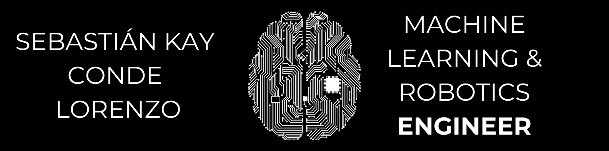

<h1 align="center">Hi 👋, I'm Sebas!</h1>
<h3 align="center">Computer Science and Maths student passionate about Deep Learning & Applied Mathematics</h3>

  

- 🔭 I’m currently working on [MiniTorch](https://github.com/cbasitodx/Multilayer_Perceptron)

- 🌱 I’m currently learning **Transformers & Attention Mechanisms, LLM's, Reinforcement Learning (and the maths behind them!), GAN's, and many more ;)**

- 👯 I’m looking to collaborate on [Pytorch](https://github.com/pytorch/pytorch)

- 💬 Ask me about **Deep Neural Networks, Image Analysis, Robotics & Arduino, Learning Algorithms, Probability, Statistics, Numerical Methods, Real Analysis & Computer Engineering!**

- 📫 Contact me at **sebastian.conde@alumnos.upm.es**

- ⚡ Fun fact **I'm a karate black belt and professional athlete!**

<h3 align="left">Connect with me:</h3>

<h3 align="left">Languages and Tools:</h3>

                  

&nbsp;

